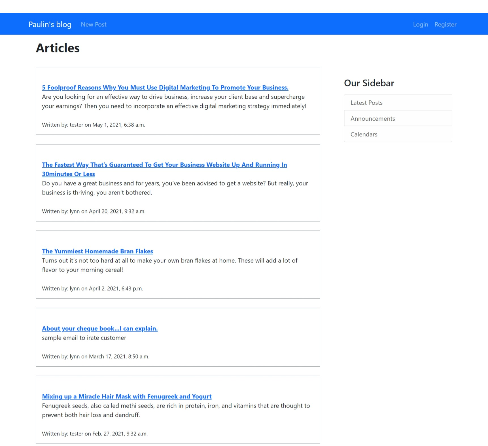
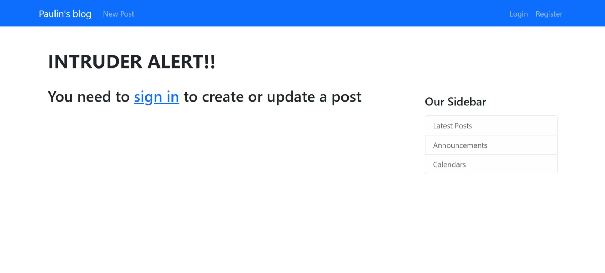

# Project Name
> Paulinsblog

## Table of contents
* [General info](#general-info)
* [Screenshots](#screenshots)
* [Technologies](#technologies)
* [Setup](#setup)
* [Features](#features)
* [Status](#status)
* [Contact](#contact)

## General info
This is my very first attempt at creating a functional blog with Django. The idea was to create a site where users can sign up and create/upload their articles, posts etc for others to review. 
## Screenshots

## Technologies
Technologies used for this build include:
Python 3.9,
Django
 & PostgreSql for the database.
A complete list of installs is included in the requirements text.

## Setup
The initial setup was quite simple. To run the project
I pip installed virtual environment wrapper, python and django on my local machine.
Set up my virtual environment and activated it using `.../Scripts/activate.bat`.
Created the project using the `django-admin startproject` command.
Adjusted my settings.py file to set up my development environment i.e. staticfiles / static_root, hiding sensitive data, etc.

Then I started creating the models (i.e. User model, Post model and Comment model) and forms for login, sign in etc. 
After every creation or adjustment of a model, I ran `python manage.py makemigrations` and `python manage.py migrate` commands to update the changes in the database. I created templates and made sure to include them in the urls and views. Finally, I wrote articles and comments to test the basic functionalities of the site.

I deployed the code to my GitHub repo. In preparation for deployment to Heroku, I installed the Heroku CLI and signed up for a free account on Heroku.
I created the app on heroku using the `heroku create paulinsblog` command. then I ran "`git add .`" to stage all commits. Using `git commit -m`, I committed the staged changes and pushed to heroku using `git push heroku main` command.

I ran into a few errors, one of which was the issue with staticfiles, I used `heroku config:set DISABLE_COLLECTSTATIC=1` to disable it.
After a successful push, I had an issue with my data failing to showing up on my Heroku site. This was because my database on the local server was running on db.sqlite which Heroku does not support. 

I had to create a datadump into a json file,  install PostgreSql database and pgAdmin4 and set up a server on my local machine. I installed the postgreSql server addon and configured it with my PostgreSql server details on my Heroku app dashboard.
 Finally I loaded the datadump json file to populate the tables in my Heroku app.

Unfortunately, my data wasn't visible on my app at this stage. I eventually ran `heroku run python manage.py migrate` to push the contents of my json file into my Heroku app database. That did the trick and all my data was reflected on the app.

If you are interested in viewing the end result, the link to the app is https://paulinesblog.herokuapp.com/.  

## Features

Basic sign up and sign in to the site.

Ability to comment on posts.
Ability to edit or discard posts if you are the author.
Users can only post or comment on the site when signed in. 

## To-do list
Complete profile pages of authors.  
Create a registration approval process.
Integrate a live chat feature. 
Bootstrap / prettify the site.
Add a landing page.

## Status
This project is in progress. Like I mentioned earlier, this is my first attempt of an app at this scale. I would love to add more robust features to it to make it fully functional

## Contact

Created by Pauline Banye - feel free to contact me!
Email - paulinebanye@gmail.com.
GitHub - https://github.com/pauline-banye
